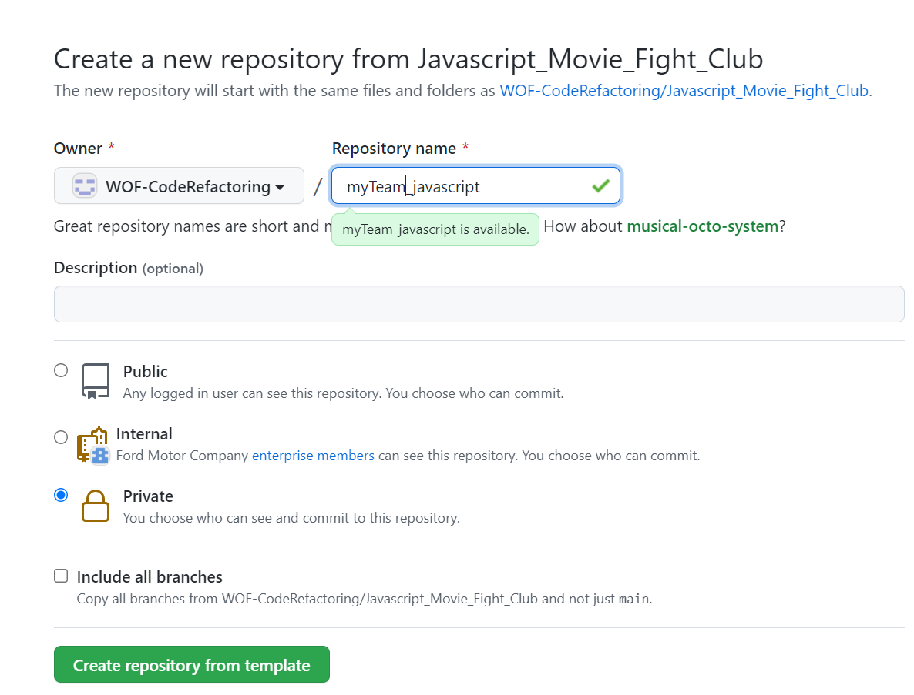

# Movie Fight Club

We can search for two movies here and we will compare them on the basis of number of awards received, metascore, box office earnings, IMDB rating and votes.

## Demo

Already deployed version available here to check it out

[Movie Fight Club](https://rococo-kashata-042c46.netlify.app/)

## How to Submit

- Create a repo(private) using this repo as template in this organization itself
  - repo name should be your Team/nick name followed by Language you choose ex: myTeam_Javscript
- Complete the refactorings and commit your code on the new repo created by you



## Refactoring Opportunities

- We are using debounce timer for reducing our api calls. That could be extracted to a seperate file to make it reusable across project
- Autocomplete suggestion box is used for both movies. There is a lot of duplication present there. That could also be extracted to a seperate file that would generate auto complete for us. And that should be independent of movies. So we can use this auto complete for anything either movies, users, students.
- Promises are nested. That couls also be avoided
- Error handling code for some apis is missing
- Some functions are large
- A lot of global variables are declared
- Some functions are not written in functional style

## Run Locally

Clone the project

```bash
  git clone https://github.ford.com/WOF-CodeRefactoring/Javascript_Movie_Fight_Club.git
```

Go to the project directory

```bash
  cd Javascript_Movie_Fight_Club
```

Install dependencies

```bash
  npm install
```

Start the server

```bash
  npm run dev
```

## Scope for improvements
- This is a plane javascript project. So it is completely imperative style of code. It can be converted to use some framework like react (extra 10 points)

## Acknowledgements

- This project is a mashup of code available on internet
- We are using [omdb movies open api](https://www.omdbapi.com/)
- For styling we are using [Bulma css](https://bulma.io/)
